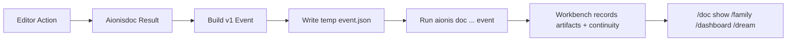

# Aionisdoc VS Code / Cursor Extension Continuity Integration Plan

Date: `2026-04-03`

Status:

- core slices landed
- extension now supports explicit task binding plus recent-task suggestions
- `compile/run` sync through `event v1 -> aionis doc ... event`
- `publish/recover/resume` sync by calling `aionis doc ... --task-id ...` directly
- sync retry, event-file preservation, sync status/history, and binding surfaces are now in place
- current remaining work is product refinement, not continuity correctness

## Goal

Connect the `Aionisdoc` VS Code / Cursor extension layer to the existing `Workbench` doc-continuity ingest path so editor-originated workflow actions become first-class Workbench continuity events.

This plan does not introduce a new protocol.

It uses the existing:

- [aionisdoc-workbench-event-v1.md](/Volumes/ziel/Aioniscli/Aionis/workbench/docs/contracts/aionisdoc-workbench-event-v1.md)
- `aionis doc --repo-root ... event --task-id ... --event ...`

## Why This Is The Right Next Step

The current system already has:

- doc workflow persistence
- `doc_learning`
- family-level `doc prior`
- dashboard-level doc-prior summaries
- dream-visible doc workflow evidence
- file-based editor event ingestion

So the next missing layer is not more Workbench memory logic.

The missing layer is:

- how the extension binds a workflow run to a Workbench task
- how it emits the v1 event automatically
- how it recovers when editor state and shell continuity diverge

## Scope

This plan covers:

- VS Code / Cursor extension continuity integration
- task binding
- file-based event emission
- operator-visible recovery rules

This plan does not cover:

- registry authoring UX
- replacing the Workbench execution host
- live sockets or background IPC
- a second event contract version

## Current Boundary

Today the minimal working path is:

1. editor performs a doc action
2. editor writes `editor-event.json`
3. editor shells out to:

```bash
aionis doc --repo-root /absolute/path/to/repo event --task-id task-123 --event ./editor-event.json
```

4. Workbench records the result into continuity

That means the Workbench side is ready enough.

The extension side is still the main implementation target now, but the minimum binding/sync path is already live for all five operator actions:

- `compile`
- `run`
- `publish`
- `recover`
- `resume`

## Product Requirements

After this plan lands, a user should be able to:

1. bind the current editor workflow session to a Workbench `task_id`
2. compile / run / publish / recover / resume from the editor
3. have the editor sync those results into Workbench continuity automatically
4. return to Workbench and immediately see:
   - `/doc show`
   - `/family`
   - `/dashboard`
   - `/dream`

update without manually replaying the same workflow in shell

## Architecture

Use a thin extension adapter layer.

Recommended shape:

- extension action executes the existing `Aionisdoc` workflow command
- extension normalizes the result into the v1 event envelope
- extension writes a temporary JSON event file
- extension shells out to `aionis doc ... event`
- Workbench remains the source of truth for:
  - artifacts
  - continuity
  - learning
  - family priors
  - dream state

Do not let the extension write directly into any Workbench JSON state.

## Extension Responsibilities

The extension should own:

- local command execution or command wrapping
- collecting action result payloads
- tracking current bound `task_id`
- emitting the v1 envelope
- invoking `aionis doc ... event`
- surfacing basic success/failure UI

The extension should not own:

- artifact persistence
- continuity mutation
- family prior generation
- dream promotion

## Task Binding Model

This is the most important product decision.

The extension should keep a lightweight local binding:

- `workspace_root`
- `task_id`
- `bound_at`
- optional `source_doc_id`

### Binding rules

Preferred order:

1. explicit task selection by the user
2. previously remembered task binding for the current workspace
3. no automatic emit if no binding exists

Do not infer `task_id` from file path alone.

## Recommended UX

### Minimum UX

- command: `Bind current workflow to Workbench task`
- prompt for:
  - repo root
  - task id
- store local binding

### Run UX

After `compile`, `run`, `publish`, `recover`, or `resume`:

- if a binding exists:
  - emit event automatically
- if no binding exists:
  - show a short notice
  - do not emit

### Recovery UX

If event ingest fails:

- show the stderr/stdout snippet
- keep the event file path available
- offer retry

## Files And Modules

### On the Workbench side

Already exists:

- [aionisdoc-workbench-event-v1.md](/Volumes/ziel/Aioniscli/Aionis/workbench/docs/contracts/aionisdoc-workbench-event-v1.md)
- [2026-04-03-aionisdoc-editor-continuity-guide.md](/Volumes/ziel/Aioniscli/Aionis/workbench/docs/product/2026-04-03-aionisdoc-editor-continuity-guide.md)
- `aionis doc ... event`

Possible small follow-up:

- add stronger CLI error messaging for malformed event files

### On the extension side

Recommended new modules:

- `workbenchTaskBinding.ts`
  - load/save current binding
- `workbenchEventEmitter.ts`
  - build v1 envelope
  - write temp file
  - invoke CLI ingest
- `workbenchStatus.ts`
  - show sync result to the user

## Implementation Order

### Task 1: Add task binding storage in the extension

Goal:

- store a workspace-local bound `task_id`

Acceptance:

- the extension can remember and retrieve the current task binding

Status:

- done via `Aionis Doc: Bind Workbench Task`
- done via `Aionis Doc: Clear Workbench Task Binding`

### Task 2: Emit v1 events after doc actions

Goal:

- wrap compile/run/publish/recover/resume results into the existing v1 envelope

Acceptance:

- every supported doc action can produce a valid event JSON file

Status:

- `compile` and `run` are implemented through `event v1`
- `publish/recover/resume` do not need a second event projection in the current slice because they already execute through Workbench CLI with a bound `task_id`

### Task 3: Shell out to `aionis doc ... event`

Goal:

- invoke the current Workbench ingest path after a successful editor action

Acceptance:

- a successful editor action updates Workbench continuity without re-running the shell command manually

Status:

- done for `compile` and `run`
- still assumes `aionis` is available on `PATH`

### Task 3B: Reuse Workbench CLI for publish / recover / resume

Goal:

- avoid rebuilding complex publish/recover/resume payloads inside the extension

Acceptance:

- the extension can call:
  - `aionis doc publish --task-id ...`
  - `aionis doc recover --task-id ...`
  - `aionis doc resume --task-id ...`
- continuity updates land in the selected task immediately

Status:

- done

### Task 4: Add minimal sync UI

Goal:

- make event ingest success/failure visible in the editor

Acceptance:

- the extension shows:
  - synced task id
  - last action
  - last sync result

Status:

- partially done
- current slice shows binding notifications, a dedicated sync status bar, `Show Workbench Sync Status`, `Show Workbench Sync History`, publish/recover/resume success toasts, and warning messages on failed ingest
- richer inline rendering is still open

### Task 5: Add recovery UX

Goal:

- make file-based handoff robust enough for real usage

Acceptance:

- failed ingest leaves a retry path
- user can inspect the event file path
- extension does not silently drop the event

Status:

- done for the current extension slice
- failed `compile/run` sync keeps the event JSON on disk
- the warning action can reveal the event file
- `Aionis Doc: Retry Last Workbench Sync` retries the last failed sync for the current workspace

## Suggested Event Flow



## Acceptance Criteria

This integration is complete when:

1. the extension can bind a stable Workbench `task_id`
2. editor doc actions emit the v1 event automatically
3. Workbench continuity updates from editor-originated actions
4. family/doc/dream surfaces reflect those actions without manual replay
5. failure paths are visible and retryable

## Risks

- weak task binding leading to events attached to the wrong task
- silently swallowing event-ingest failures
- diverging payload shape between extension output and Workbench v1 contract
- adding too much editor UX before the sync path is stable

## Guardrails

- keep the contract at v1 for now
- use Workbench as the only writer of Workbench continuity
- do not add sockets or background daemons yet
- do not ship auto-binding heuristics based only on open file paths

## Recommended First Slice

If only one slice is implemented next, do this:

1. task binding storage
2. emit event after `publish`
3. call `aionis doc ... event`
4. verify `/doc show` updates

That slice proves the integration with the least moving parts.
