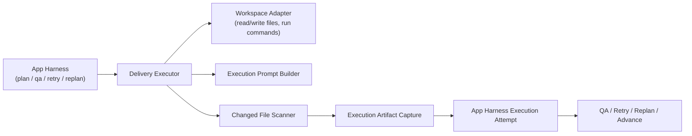

# Aionis Delivery Executor Plan (CC extracted-src inspired)

**Goal:** Make `Aionis Workbench` capable of running a real task and producing a real application artifact, instead of stopping at planner/evaluator/retry/replan metadata.

**Decision:** Do **not** try to directly embed or depend on `DeepAgents` for the app-delivery path, and do **not** vendor `/Volumes/ziel/CC/extracted-src` as a runtime dependency. Use `CC extracted-src` only as a design donor, then build a Workbench-owned delivery executor in Python that plugs into the current app harness.

## Why This Plan Exists

Current state:

- `run / resume` can already drive real repo work in some narrow flows
- `app harness` can already do:
  - `plan`
  - `qa`
  - `negotiate`
  - `retry`
  - `replan`
  - `advance`
- but `app generate` still mostly records an execution attempt and a bounded artifact shell

That means the current system can **organize** long tasks, but it cannot yet **deliver** them as a real application build loop.

This is the exact gap blocking:

- real task execution
- real artifact comparison against baseline
- any honest claim that `Aionis` can run production-meaningful tasks

## Hard Conclusion

`/Volumes/ziel/CC/extracted-src` is **not** a drop-in replacement runtime.

Why:

- it looks like a partial Claude Code / CCR source extraction, not a clean embeddable library
- there is no obvious standalone package/build boundary
- many modules are tightly coupled to Anthropic session state, transport, feature flags, and internal storage
- some SDK entrypoints are explicitly stubbed as `not implemented`

So:

- **Do use it for architecture reference**
- **Do not import it as a new hard dependency for Workbench**

## What To Borrow From CC extracted-src

The most valuable donor modules are:

### 1. Query / tool loop

Reference:

- `/Volumes/ziel/CC/extracted-src/src/QueryEngine.ts`

Useful ideas:

- one-query lifecycle
- tool pool assembly
- persistent message/thread state
- turn-scoped execution context
- file-history and read-cache handling

### 2. Agent definition and isolation model

Reference:

- `/Volumes/ziel/CC/extracted-src/src/tools/AgentTool/loadAgentsDir.ts`

Useful ideas:

- declarative agent definitions
- bounded tool permissions
- worktree/isolation semantics
- background vs foreground execution modes

### 3. File persistence / changed-file capture

Reference:

- `/Volumes/ziel/CC/extracted-src/src/utils/filePersistence/filePersistence.ts`

Useful ideas:

- turn-end file capture
- changed-file scanning
- explicit persisted-file result object
- artifact-level proof after execution

## Architecture Direction

Build a **Workbench-native delivery executor** with this shape:

### Core principle

The delivery executor should become the missing bridge between:

- `SprintContract / SprintRevision`
- and
- real file changes + real runnable artifact + real validation feedback

## Required Outcome

After this plan lands, `Aionis` should be able to:

1. Accept a real app task
2. Materialize a real project workspace
3. Execute one bounded implementation attempt against that workspace
4. Capture:
   - changed files
   - artifact paths
   - run command
   - validation command results
5. Feed those results back into:
   - `qa`
   - `retry`
   - `replan`
   - `advance`
6. Produce a side-by-side artifact that a human can actually inspect

## Non-Goals

This plan is **not** trying to build:

- a full Claude Code clone
- a multi-tenant remote agent platform
- a browser-grade evaluation system
- a fully autonomous multi-agent swarm

This is a **delivery-bridge plan**, not a platform rewrite.

## Recommended Implementation Strategy

### Decision 1: Keep Workbench as the orchestrator

Do not split the system into:

- `app harness`
- `delivery runtime`
- `second executor framework`

Keep the current Workbench as the control plane and add one new owned layer:

- `delivery_executor.py`

### Decision 2: Use CC extracted-src as reference only

Do not:

- import its TS files into production execution
- rely on its internal runtime contracts
- create a second “Claude-compatible” substrate inside Workbench

Do:

- port the smallest useful concepts
- keep the production implementation in current Workbench Python

### Decision 3: Start with one bounded execution lane

The first shipping version should only do:

- one bounded execution attempt for the active sprint or latest revision
- one changed-file scan
- one artifact capture
- one validation step

That is enough to honestly answer:

`Can Aionis run a real task?`

## Proposed Components

### New source files

- Create: `/Volumes/ziel/Aioniscli/Aionis/workbench/src/aionis_workbench/delivery_executor.py`
- Create: `/Volumes/ziel/Aioniscli/Aionis/workbench/src/aionis_workbench/delivery_workspace.py`
- Create: `/Volumes/ziel/Aioniscli/Aionis/workbench/src/aionis_workbench/delivery_prompts.py`
- Create: `/Volumes/ziel/Aioniscli/Aionis/workbench/src/aionis_workbench/delivery_results.py`

### Likely modified source files

- Modify: `/Volumes/ziel/Aioniscli/Aionis/workbench/src/aionis_workbench/runtime.py`
- Modify: `/Volumes/ziel/Aioniscli/Aionis/workbench/src/aionis_workbench/app_harness_service.py`
- Modify: `/Volumes/ziel/Aioniscli/Aionis/workbench/src/aionis_workbench/execution_host.py`
- Modify: `/Volumes/ziel/Aioniscli/Aionis/workbench/src/aionis_workbench/evaluation_service.py`
- Modify: `/Volumes/ziel/Aioniscli/Aionis/workbench/src/aionis_workbench/session.py`
- Modify: `/Volumes/ziel/Aioniscli/Aionis/workbench/src/aionis_workbench/shell.py`
- Modify: `/Volumes/ziel/Aioniscli/Aionis/workbench/src/aionis_workbench/cli.py`

### Tests

- Create: `/Volumes/ziel/Aioniscli/Aionis/workbench/tests/test_delivery_executor.py`
- Create: `/Volumes/ziel/Aioniscli/Aionis/workbench/tests/test_delivery_workspace.py`
- Modify: `/Volumes/ziel/Aioniscli/Aionis/workbench/tests/test_product_workflows.py`
- Modify: `/Volumes/ziel/Aioniscli/Aionis/workbench/tests_real_e2e/test_app_harness_planner_contract.py`

## Delivery Executor Contract

Minimum execution request:

- `task_id`
- `repo_root`
- `product_spec`
- `active_sprint_contract`
- `latest_revision`
- `execution_focus`
- `target_files`
- `validation_commands`

Minimum execution result:

- `attempt_id`
- `status`
- `changed_files`
- `changed_file_count`
- `artifact_paths`
- `run_command`
- `validation_results`
- `execution_summary`
- `failure_reason`

## Task Plan

### Task 1: Freeze the delivery-executor contract

Define the exact request/response shapes for one bounded execution attempt.

Success condition:

- `app generate` no longer means “metadata only”
- it means “start one real implementation attempt”

### Task 2: Build a workspace adapter

Create a thin layer responsible for:

- preparing the target repo/worktree
- resolving writable roots
- recording changed files before/after execution
- exposing artifact output directories

Reference donor:

- `CC extracted-src` file persistence flow

### Task 3: Build a delivery prompt builder

Construct the execution prompt from:

- `ProductSpec`
- `SprintContract`
- `SprintRevision`
- `execution_focus`
- explicit artifact goals

The prompt must be implementation-facing, not planner-facing.

### Task 4: Add one real local execution path

Implement one bounded execution lane that:

- invokes the underlying coding model/tool loop
- allows real file edits
- captures changed files
- returns a structured execution result

This is the point where Workbench starts actually “doing work”.

### Task 5: Bind `app generate` to the delivery executor

`app generate` should:

- trigger a real execution attempt
- persist changed-file evidence
- persist artifact paths
- keep the existing app harness metadata

### Task 6: Feed execution results into QA

Make `app qa` consume:

- changed files
- artifact paths
- run command
- validation result

So QA judges the real product state, not just the abstract sprint state.

### Task 7: Upgrade retry/replan policy to use real execution failures

Policy should distinguish:

- planning failure
- execution failure
- validation failure
- artifact incompleteness

This is where retry/replan becomes product-real, not harness-only.

### Task 8: Add a real artifact trial flow

Use the fixed case:

- `Stateful Visual Dependency Explorer`

Require:

- a real runnable app
- screenshots
- checklist completion
- artifact stored in case directory

### Task 9: Run the first honest side-by-side trial

Compare:

- baseline artifact
- Aionis artifact

Judge only by:

- can it run
- does it work
- is it stable
- is it demoable

### Task 10: Decide go/no-go honestly

At the end of the first trial, decide one of:

- `Aionis can now run real tasks`
- `Aionis still cannot run real tasks`

No benchmark language should override this decision.

## Risks

### Risk 1: Hidden second-runtime sprawl

If CC extracted-src concepts are copied too literally, Workbench will grow a shadow runtime.

Mitigation:

- port concepts, not framework structure

### Risk 2: Overbuilding before first real task

It is easy to spend more time designing than proving.

Mitigation:

- ship one bounded execution lane first
- prove against one real app task immediately

### Risk 3: Metadata leakage

If the executor still returns mostly summaries instead of concrete outputs, the system will look better than it is.

Mitigation:

- require changed files
- require artifact paths
- require runnable output

## Success Bar

This plan only counts as successful if the following sentence becomes true:

`Aionis Workbench can take a real app task, execute a bounded implementation attempt, produce a runnable artifact, and continue iterating on that artifact through QA, retry, and replan.`

If that sentence is still false after implementation, then the plan is incomplete.
