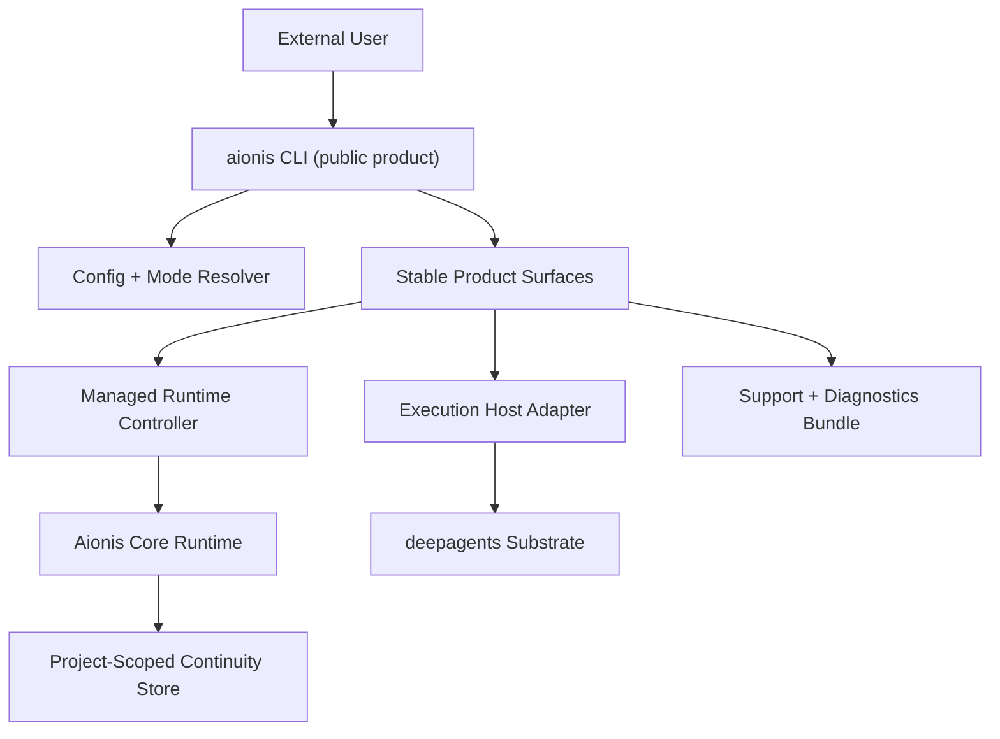

# Aionis External Release Productization Plan

> **For Claude:** REQUIRED SUB-SKILL: Use superpowers:executing-plans to implement this plan task-by-task.

**Goal:** Turn `Aionis Workbench` from a strong internal multi-agent shell into a CLI-first product that can be installed, supported, and released externally with a clear stable surface.

**Architecture:** Treat `workbench/` as the only public product boundary. `runtime-mainline/` becomes a managed runtime dependency behind product commands rather than a user-visible subsystem. Reduce the external contract to a small stable command set, isolate beta/internal surfaces, and build release gates around clean-machine installation, configuration isolation, and predictable support flows.

**Tech Stack:** Python 3.11+, Node 22, `argparse`, `pytest`, provider profiles, shell scripts, release gates, and GitHub Actions or equivalent release CI.

---

## Why This Plan Exists

`Aionis` is already beyond prototype quality in several important ways:

- real CLI product surfaces exist
- deterministic and live validation exist
- runtime, execution host, and Workbench boundaries are conceptually separated
- project-scoped learning and recovery are already product-real

But those strengths are still packaged like an internal engineering workspace instead of an external product.

The biggest current gap is not missing capability. The biggest current gap is release shape:

- too many commands are exposed at once
- install and runtime ownership still feel developer-oriented
- configuration can leak from local machine state
- docs and actual code boundaries are starting to drift
- support and diagnostics are not yet packaged like a public product

This plan optimizes for shipping a credible external beta without pretending the entire workspace is already release-ready.

## Product Target

### Audience for the first external release

- technical design partners
- power users comfortable with CLI workflows
- teams evaluating multi-run reuse and continuity in one codebase

### V1 product promise

For one repository, `Aionis` should help the user:

1. understand whether the environment is usable
2. start a task through one obvious entry path
3. resume interrupted work without losing context
4. inspect current state and next steps without reading internals
5. use inspect-only mode productively when live execution is unavailable

### V1 non-goals

The first external release should not try to expose every current internal surface as stable:

- no promise that every `app`, `doc`, `dream`, or `ab-test` surface is GA
- no promise that every provider profile is release-approved
- no promise that the full research workspace layout is a public contract

## Release Bar

An external beta should not ship until all of the following are true:

1. A clean machine can install and run `aionis ready` without reading internal docs.
2. Stable commands have deterministic product-path tests and release gates.
3. Inspect-only mode is clearly documented and intentionally supported.
4. Live mode has an explicit provider support matrix and recovery path.
5. Product docs, CLI help, and actual behavior describe the same command surface.
6. Support can request a diagnostic bundle instead of guessing from screenshots.

## Key Product Decisions

### Decision 1: `workbench` is the public product

Externally, the product is `Aionis Workbench`, surfaced through the `aionis` CLI.

Implication:

- `runtime-mainline/` is part of implementation and distribution, not part of the user-facing mental model
- `deepagents-host/` remains an integration boundary, not a public product area

### Decision 2: the CLI must have stable, beta, and internal tiers

The current command set is too wide for a first external release.

Recommended tiering:

- `stable`: `init`, `doctor`, `ready`, `status`, `run`, `resume`, `session`
- `beta`: `dashboard`, `compare-family`, `recent-tasks`, `consolidate`, `live-profile`
- `internal`: `dream`, `ab-test`, `app`, `doc`, `backfill`, experimental shell/operator surfaces

### Decision 3: runtime ownership must move from user assembly to product management

The user should not have to understand Python package install, Node package install, runtime startup, and provider setup as separate systems.

The product should either:

- manage the runtime directly from the CLI, or
- provide one officially supported runtime bundle with clear health checks

### Decision 4: configuration must be explicit and test-isolated

Product behavior must not silently change because a developer machine has a local `.env` file with credentials.

Configuration precedence should be:

1. CLI flags
2. explicit config file
3. environment variables
4. defaults

Implicit local file loading should be opt-in or strictly scoped to product entrypoints.

## High-Level Architecture For External Release

## Phase 1: Define the Public Product Contract

### Task 1: Split the CLI into stable, beta, and internal command tiers

**Files:**
- Modify: `/Volumes/ziel/Aioniscli/Aionis/workbench/src/aionis_workbench/cli.py`
- Modify: `/Volumes/ziel/Aioniscli/Aionis/workbench/src/aionis_workbench/shell.py`
- Modify: `/Volumes/ziel/Aioniscli/Aionis/workbench/README.md`
- Modify: `/Volumes/ziel/Aioniscli/Aionis/workbench/docs/product/2026-04-01-aionis-workbench-overview.md`

**Goal:** Shrink the external contract to a supportable product surface.

**Acceptance:**

- `--help` clearly distinguishes stable, beta, and internal commands
- README and overview docs only position stable commands as the main workflow
- beta/internal commands are still usable, but no longer frame the top-level product story

### Task 2: Publish a V1 product definition and support policy

**Files:**
- Create: `/Volumes/ziel/Aioniscli/Aionis/workbench/docs/product/2026-04-15-aionis-external-beta-definition.md`
- Modify: `/Volumes/ziel/Aioniscli/Aionis/workbench/README.md`

**Goal:** Make it obvious what the first external release does and does not promise.

**Acceptance:**

- the docs define target users, supported platforms, stable commands, and non-goals
- support expectations and beta caveats are explicit

## Phase 2: Fix Installation and Runtime Ownership

### Task 3: Replace the developer install story with a product install story

**Files:**
- Modify: `/Volumes/ziel/Aioniscli/Aionis/scripts/install-local-aionis.sh`
- Modify: `/Volumes/ziel/Aioniscli/Aionis/workbench/README.md`
- Modify: `/Volumes/ziel/Aioniscli/Aionis/workbench/docs/product/2026-04-03-aionis-launcher-guide.md`
- Modify: `/Volumes/ziel/Aioniscli/Aionis/workbench/src/aionis_workbench/runtime_manager.py`

**Goal:** Make first install feel like product onboarding rather than local developer bootstrap.

**Acceptance:**

- one documented install path works on a clean machine
- post-install guidance leads directly to `aionis ready`
- runtime status and repair steps are part of the install flow

### Task 4: Make runtime management a product capability

**Files:**
- Modify: `/Volumes/ziel/Aioniscli/Aionis/workbench/src/aionis_workbench/runtime_manager.py`
- Modify: `/Volumes/ziel/Aioniscli/Aionis/workbench/src/aionis_workbench/ops_service.py`
- Modify: `/Volumes/ziel/Aioniscli/Aionis/workbench/src/aionis_workbench/cli.py`
- Modify: `/Volumes/ziel/Aioniscli/Aionis/runtime-mainline/apps/lite/README.md`

**Goal:** Remove the need for users to manually reason about the runtime as a separate subsystem.

**Acceptance:**

- `aionis status`, `aionis doctor`, and `aionis ready` can explain runtime state in product language
- the runtime can be started, stopped, and health-checked through supported product paths
- runtime setup steps no longer require reading internal workspace structure

## Phase 3: Harden Configuration and Failure Boundaries

### Task 5: Stop implicit machine-local config leakage

**Files:**
- Modify: `/Volumes/ziel/Aioniscli/Aionis/workbench/src/aionis_workbench/runtime.py`
- Modify: `/Volumes/ziel/Aioniscli/Aionis/workbench/src/aionis_workbench/config.py`
- Modify: `/Volumes/ziel/Aioniscli/Aionis/workbench/tests/test_bootstrap.py`
- Modify: `/Volumes/ziel/Aioniscli/Aionis/workbench/tests/test_cli_shell.py`
- Modify: `/Volumes/ziel/Aioniscli/Aionis/workbench/tests/conftest.py`

**Goal:** Ensure product behavior is deterministic across machines and test environments.

**Acceptance:**

- tests do not depend on local `.env` files
- credential presence is explicit in tests
- configuration precedence is documented and enforced
- `doctor()` and related surfaces behave the same on clean and credentialed machines when test inputs are the same

### Task 6: Productize live failure and degraded-mode recovery

**Files:**
- Modify: `/Volumes/ziel/Aioniscli/Aionis/workbench/src/aionis_workbench/cli.py`
- Modify: `/Volumes/ziel/Aioniscli/Aionis/workbench/src/aionis_workbench/ops_service.py`
- Modify: `/Volumes/ziel/Aioniscli/Aionis/workbench/src/aionis_workbench/shell.py`
- Modify: `/Volumes/ziel/Aioniscli/Aionis/workbench/src/aionis_workbench/shell_dispatch.py`
- Create: `/Volumes/ziel/Aioniscli/Aionis/workbench/docs/product/2026-04-15-aionis-troubleshooting-guide.md`

**Goal:** Make failure states feel like a product mode with guidance, not raw system leakage.

**Acceptance:**

- blocked live flows explain what still works now
- the top two next repair actions are explicit
- troubleshooting docs map directly to CLI output wording

## Phase 4: Release-Grade Engineering Hygiene

### Task 7: Add static quality gates and workspace hygiene rules

**Files:**
- Modify: `/Volumes/ziel/Aioniscli/Aionis/workbench/pyproject.toml`
- Modify: `/Volumes/ziel/Aioniscli/Aionis/workbench/scripts/run-release-gates.sh`
- Create: `/Volumes/ziel/Aioniscli/Aionis/workbench/.gitignore`
- Create: `/Volumes/ziel/Aioniscli/Aionis/workbench/docs/plans/2026-04-15-aionis-release-gates-checklist.md`

**Goal:** Reduce accidental regressions and keep release artifacts clean.

**Acceptance:**

- lint and type checks run in the same release gate path as product tests
- `tmp`, caches, and local environments are excluded from the intended release surface
- the release checklist is concrete enough for a human operator to run

### Task 8: Separate release artifacts from the research workspace

**Files:**
- Modify: `/Volumes/ziel/Aioniscli/Aionis/README.md`
- Modify: `/Volumes/ziel/Aioniscli/Aionis/STRUCTURE.md`
- Create: `/Volumes/ziel/Aioniscli/Aionis/workbench/docs/product/2026-04-15-aionis-distribution-model.md`

**Goal:** Prevent the consolidated workspace from becoming the accidental public product contract.

**Acceptance:**

- docs explain what ships and what remains internal
- `samples`, `swebench`, `runtime-legacy`, and local temp state are explicitly non-product areas
- the product distribution model is documented before external packaging starts

## Phase 5: Trust, Support, and Observability

### Task 9: Add a stable support and diagnostics surface

**Files:**
- Modify: `/Volumes/ziel/Aioniscli/Aionis/workbench/src/aionis_workbench/cli.py`
- Modify: `/Volumes/ziel/Aioniscli/Aionis/workbench/src/aionis_workbench/ops_service.py`
- Create: `/Volumes/ziel/Aioniscli/Aionis/workbench/src/aionis_workbench/support_bundle.py`
- Create: `/Volumes/ziel/Aioniscli/Aionis/workbench/tests/test_support_bundle.py`

**Goal:** Make external support scalable and reproducible.

**Acceptance:**

- one command can produce a sanitized diagnostic bundle
- support can inspect mode, provider profile, runtime health, and recent product state without asking the user to manually collect logs

### Task 10: Publish a provider support matrix and release policy

**Files:**
- Modify: `/Volumes/ziel/Aioniscli/Aionis/workbench/docs/product/2026-04-03-aionis-provider-setup-guide.md`
- Create: `/Volumes/ziel/Aioniscli/Aionis/workbench/docs/product/2026-04-15-aionis-provider-support-matrix.md`
- Modify: `/Volumes/ziel/Aioniscli/Aionis/workbench/src/aionis_workbench/provider_profiles.py`

**Goal:** Set external expectations around live support and release quality.

**Acceptance:**

- each provider profile has a documented support tier
- the docs distinguish `experimental`, `beta-supported`, and `release-approved`
- CLI surfaces do not imply that every configured provider is equally supported

## Phase 6: Beta Launch Readiness

### Task 11: Create a launch checklist for design-partner beta

**Files:**
- Create: `/Volumes/ziel/Aioniscli/Aionis/workbench/docs/product/2026-04-15-aionis-design-partner-beta-checklist.md`
- Modify: `/Volumes/ziel/Aioniscli/Aionis/workbench/README.md`

**Goal:** Define the smallest credible launch unit before public expansion.

**Acceptance:**

- the checklist covers install, stable commands, degraded mode, live mode, docs, and support bundle verification
- design partners can be onboarded with one bounded doc set

### Task 12: Add release-candidate product-path tests

**Files:**
- Modify: `/Volumes/ziel/Aioniscli/Aionis/workbench/tests/test_product_workflows.py`
- Create: `/Volumes/ziel/Aioniscli/Aionis/workbench/tests_real_e2e/test_external_beta_path.py`
- Create: `/Volumes/ziel/Aioniscli/Aionis/workbench/tests_real_live_e2e/test_external_beta_live_path.py`

**Goal:** Verify the public product path instead of only internal module contracts.

**Acceptance:**

- deterministic tests cover install-ready, inspect-only-ready, run, resume, and session inspection paths
- live beta tests cover at least one release-approved provider path

## Recommended Execution Order

1. Phase 1: reduce the public surface before adding more release ceremony
2. Phase 2: make install and runtime ownership coherent
3. Phase 3: harden config and recovery behavior
4. Phase 4: add release hygiene and artifact boundaries
5. Phase 5: add support tooling and provider policy
6. Phase 6: run a design-partner beta before broader release

## Milestones

### Milestone A: Supportable private beta

Required:

- stable command tier is documented
- clean install path works
- config leakage is removed
- inspect-only mode is intentionally documented

### Milestone B: Credible external beta

Required:

- support bundle exists
- provider support matrix exists
- release gates include static checks and product-path tests
- docs and CLI help align

### Milestone C: Public beta readiness

Required:

- at least one provider path is release-approved
- runtime ownership is fully productized
- support burden is bounded by diagnostics and known recovery flows

## Main Risks And Mitigations

### Risk 1: command sprawl keeps diluting the product story

Mitigation:

- freeze stable command scope for the first beta
- keep new experimental commands out of the default help surface

### Risk 2: runtime complexity leaks into support load

Mitigation:

- make runtime a managed product capability
- keep `doctor`, `ready`, and diagnostics authoritative

### Risk 3: local machine state keeps causing false regressions

Mitigation:

- remove implicit config loading from core construction paths
- make tests declare all credential assumptions explicitly

### Risk 4: docs continue drifting from real code boundaries

Mitigation:

- require doc updates as part of release gates for stable surface changes
- keep one canonical product definition doc

## Judgment

The correct next move is not to expose more of the current internal platform. The correct next move is to narrow the public promise, harden the stable path, and package the runtime/config/support story like a product.

If this plan is followed in order, `Aionis` can reach a credible external beta without pretending the entire internal workspace is already ready for public contract lock-in.
