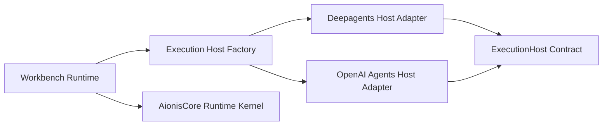

# Workbench Execution Host Migration Plan

**Date:** 2026-04-16  
**Status:** proposed, phase 1 started  
**Owner:** Workbench

## Summary

`Workbench` can move from `deepagents` to [`openai-agents-python`](https://github.com/openai/openai-agents-python), but this should be done as an execution-host migration, not a runtime-kernel rewrite.

The right boundary is:

- `AionisCore` stays the continuity and memory kernel
- `Workbench` owns the execution host and controller shell
- the execution host becomes a replaceable adapter behind one stable contract

This plan starts by creating that adapter boundary while keeping `deepagents` as the default implementation.

## Why change now

Current `Workbench` still depends on `deepagents` for:

- live task execution
- local shell-backed tool use
- direct/delivery agent loops
- execution-host naming and health metadata

That dependency is now the main remaining substrate lock-in in the product shell.

`openai-agents-python` is now a credible replacement candidate because the official surface includes:

- agents and handoffs
- sessions
- tracing
- guardrails
- sandbox agents
- shell and patch-oriented tooling

That makes it realistic to replace the execution host without changing `AionisCore`.

## Decision

`Workbench` should migrate to a host-adapter architecture with two phases of compatibility:

1. `deepagents` remains the default host behind a generic `ExecutionHost` contract
2. `openai-agents-python` lands as a second host implementation
3. after parity, `deepagents` becomes optional fallback
4. after enough live and deterministic confidence, `openai-agents-python` becomes the default

## Non-goals

This migration should **not**:

- move execution-host logic into `AionisCore`
- rewrite continuity, replay, handoff, or review-pack flows
- change `Workbench` controller semantics
- change shell/status/controller payload contracts as part of phase 1
- remove `deepagents` before parity exists

## Current dependency surface

Today the deepest coupling is concentrated in:

- `src/aionis_workbench/execution_host.py`
- `src/aionis_workbench/runtime.py`
- `src/aionis_workbench/orchestrator.py`
- `src/aionis_workbench/delivery_executor.py`
- `src/aionis_workbench/host_contract.py`

The execution host currently provides three groups of behavior:

1. host description
   - `describe()`
   - `supports_live_tasks()`
   - runtime/backend/provider metadata
2. agent execution
   - `build_agent()`
   - `invoke()`
   - `build_delivery_agent()`
   - `invoke_delivery_task()`
3. live app-harness planning/evaluation/generation
   - `plan_app_live()`
   - `evaluate_sprint_live()`
   - `negotiate_sprint_live()`
   - `revise_sprint_live()`
   - `replan_sprint_live()`
   - `generate_app_live()`

That is the contract we need to preserve during migration.

## Target architecture

Key rule:

- `Workbench Runtime` depends on the contract
- concrete host adapters depend on their own substrate SDKs
- `AionisCore` remains unaffected

## Recommended execution-host contract

Phase 1 contract shape:

- host description
- live capability probe
- task agent build/invoke
- delivery build/invoke
- live app harness planning/evaluation/generation methods
- timeout and token budget introspection

This is intentionally broader than a minimal `run(task)` interface because `Workbench` already exposes live app harness operations that would otherwise leak substrate details back up into runtime code.

## Migration phases

### Phase 1: decouple runtime from the concrete deepagents type

Deliverables:

- add a generic `ExecutionHost` protocol
- add host metadata defaults in one place
- instantiate hosts through a factory
- make `runtime.py`, `orchestrator.py`, and `delivery_executor.py` depend on the protocol, not `DeepagentsExecutionHost`
- add `WORKBENCH_EXECUTION_HOST` config with `deepagents` as default

Exit criteria:

- no product behavior changes
- deterministic tests stay green
- `deepagents` remains the only active implementation

### Phase 2: add `OpenAIAgentsExecutionHost`

Deliverables:

- new adapter module backed by `openai-agents-python`
- parity for:
  - `describe`
  - `supports_live_tasks`
  - `build_agent`/`invoke`
  - `build_delivery_agent`/`invoke_delivery_task`
- explicit capability gaps documented for app harness methods that are still pending

Exit criteria:

- `run`/`resume`/delivery paths work behind the new host
- deterministic contract suite passes on both substrates where supported

### Phase 3: close app-harness parity

Deliverables:

- parity for:
  - `plan_app_live`
  - `evaluate_sprint_live`
  - `negotiate_sprint_live`
  - `revise_sprint_live`
  - `replan_sprint_live`
  - `generate_app_live`
- host metadata clearly distinguishes:
  - `execution_runtime`
  - `backend`
  - `sandbox_mode`

Exit criteria:

- app/doc flows no longer assume `deepagents`
- live e2e has passing coverage on the new host

### Phase 4: make `deepagents` optional

Deliverables:

- move `deepagents` out of the default dependency list
- make it an extra or compatibility extra
- default factory route selects `openai_agents`
- keep `deepagents` as fallback for a bounded compatibility window

Exit criteria:

- install path works without `deepagents`
- deterministic CI and live gate pass on the default host

## Risks

### Risk: local shell semantics drift

`deepagents + LocalShellBackend` currently define a lot of implicit behavior around filesystem scope, shell invocation, and patch application.

Mitigation:

- keep the delivery contract fixed
- port delivery tests first
- compare workspace traces and changed-file evidence before cutover

### Risk: app-harness parity takes longer than expected

The app-harness live methods are more specialized than the main `run`/`resume` path.

Mitigation:

- migrate core execution first
- keep app-harness on `deepagents` until parity exists
- allow host-level feature flags during the overlap window

### Risk: controller surfaces accidentally absorb substrate details

Mitigation:

- preserve `controller_action_bar`, session state, and host contract schemas
- expose substrate only via `execution_host` metadata

## Testing plan

Phase 1 must keep these green:

- `tests/test_delivery_executor.py`
- `tests/test_bootstrap.py`
- `tests/test_product_workflows.py`
- `scripts/run-controller-contract-suite.sh`
- `scripts/run-real-e2e.sh`

Phase 2 and Phase 3 should add:

- substrate-agnostic execution host contract tests
- one shared fixture suite run against both adapters where feature parity exists

## Immediate implementation order

1. add execution-host contract module
2. add execution-host factory
3. thread the contract through runtime/orchestrator/delivery paths
4. add config selector with `deepagents` default
5. keep all behavior and docs honest: current default remains `deepagents`

## Current status

Started:

- phase 1 contract/factory extraction
- phase 2 host skeleton, selection, and auth-probe wiring
- experimental single-agent local tool loop for `build_agent + invoke`
- experimental delivery loop for `build_delivery_agent + invoke_delivery_task`
- experimental JSON app-harness live methods for planner/evaluator/negotiator/revisor/replanner/generator
- OpenRouter-compatible model resolution now uses an explicit `OpenAIChatCompletionsModel` path instead of raw prefixed model ids
- auth probes on the `openai_agents` host now use a slightly wider timeout and retry transient `OpenAIAgentsModelInvokeTimeout` failures instead of failing readiness on the first slow response
- live evaluator prompts now treat `requested_status` and explicit `criteria_scores` as high-signal operator input, instead of letting sparse narrative evidence dominate by default
- real auth probe passed with `WORKBENCH_EXECUTION_HOST=openai_agents`
- `tests_real_live_e2e/test_live_app_plan.py` passed with `WORKBENCH_EXECUTION_HOST=openai_agents`
- `tests_real_live_e2e/test_live_app_qa.py` passed with `WORKBENCH_EXECUTION_HOST=openai_agents`
- `tests_real_live_e2e/test_live_app_negotiate.py` passed with `WORKBENCH_EXECUTION_HOST=openai_agents`
- `tests_real_live_e2e/test_live_app_retry.py` passed with `WORKBENCH_EXECUTION_HOST=openai_agents`
- `tests_real_live_e2e/test_live_app_replan.py` passed with `WORKBENCH_EXECUTION_HOST=openai_agents`
- `tests_real_live_e2e/test_live_app_generate.py` passed with `WORKBENCH_EXECUTION_HOST=openai_agents`
- `tests_real_live_e2e/test_live_app_escalate.py` passed with `WORKBENCH_EXECUTION_HOST=openai_agents`
- `tests_real_live_e2e/test_live_app_replan_generate_qa.py` passed with `WORKBENCH_EXECUTION_HOST=openai_agents`
- `tests_real_live_e2e/test_live_app_replan_generate_qa_advance.py` passed with `WORKBENCH_EXECUTION_HOST=openai_agents`
- a dedicated manual workflow now exists at `.github/workflows/workbench-live-openai-agents.yml`
- the narrow experimental live slice is codified in `scripts/run-real-live-openai-agents-e2e.sh`

Not started:

- optional dependency split
- app-harness parity on the new substrate
