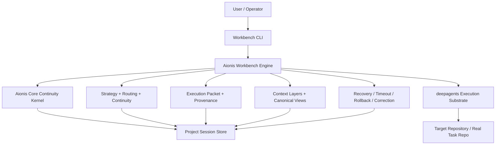

# Aionis Workbench Overview

Date: 2026-04-01

Audience:

- product stakeholders
- technical evaluators
- early design partners
- prospective collaborators

## Executive Summary

Aionis Workbench is a multi-agent coding workbench built on top of:

- `deepagents` as the execution substrate
- `Aionis Core` as the continuity and replay kernel
- `aionis-workbench` as the product control plane

Its core purpose is not just to run agents once, but to make subsequent work in the same project better by carrying forward:

- project-scoped memory
- validated strategies
- artifact references
- role routing patterns
- recovery state

In practical terms, Workbench is designed to make the next task in the same codebase:

- start narrower
- validate faster
- reuse better evidence
- recover more cleanly
- explain its own strategy more clearly

This is already validated on a growing real-task corpus using `pallets/click`.

For the latest implemented platform state, see:

- [2026-04-03-aionis-workbench-platform-status.md](../plans/2026-04-03-aionis-workbench-platform-status.md)

Historical validation examples later in this document still reference original internal sample workspaces from the monorepo phase. Treat those as archival evidence, not as the default path for this standalone repository.

## Product Definition

Workbench is a project-scoped multi-agent coding shell that does five things together:

1. runs and resumes coding tasks
2. ingests externally completed validated work
3. converts successful work into reusable continuity
4. converts failures into reusable recovery state
5. selects collaboration strategy for later tasks from prior project evidence

It is not a full market-facing product shell yet. Today it is best described as:

- a production-oriented product kernel
- a CLI-first workbench engine
- a structured continuity and collaboration layer on top of `deepagents`

## External Beta Command Surface

For the first external beta, the product should be described through a narrow stable command path:

- `init`
- `doctor`
- `ready`
- `status`
- `run`
- `resume`
- `session`

Those commands are the intended external product entry.

The following surfaces are better treated as secondary or beta:

- `setup`
- `shell`
- `live-profile`
- `compare-family`
- `recent-tasks`
- `dashboard`
- `consolidate`

Deeper operator and research surfaces such as `app`, `doc`, `dream`, `ab-test`, `backfill`, and `ship` are real product capabilities, but they should not define the first external understanding of what Aionis is.

## Architecture

### Layered Architecture

### Runtime Responsibilities

#### 1. Execution substrate

Current substrate:

- `deepagents`

Responsibility:

- agent execution
- tool invocation
- middleware flow
- shell-backed task execution

#### 2. Continuity kernel

Current kernel:

- `Aionis Core`

Responsibility:

- task start
- task handoff
- task replay
- continuity state persistence

#### 3. Workbench engine

Current engine repo:

- `Aionis Workbench`

Core engine modules:

- [runtime.py](../../src/aionis_workbench/runtime.py)
  - thin facade and runtime-bound packet/instrumentation assembly
- [ops_service.py](../../src/aionis_workbench/ops_service.py)
- [session_service.py](../../src/aionis_workbench/session_service.py)
- [recovery_service.py](../../src/aionis_workbench/recovery_service.py)
- [orchestrator.py](../../src/aionis_workbench/orchestrator.py)
- [surface_service.py](../../src/aionis_workbench/surface_service.py)
- [runtime_contracts.py](../../src/aionis_workbench/runtime_contracts.py)
- [policies.py](../../src/aionis_workbench/policies.py)
- [session.py](../../src/aionis_workbench/session.py)
- [context_layers.py](../../src/aionis_workbench/context_layers.py)
- [execution_packet.py](../../src/aionis_workbench/execution_packet.py)
- [provenance.py](../../src/aionis_workbench/provenance.py)
- [aionis_bridge.py](../../src/aionis_workbench/aionis_bridge.py)
- [cli.py](../../src/aionis_workbench/cli.py)
- [config.py](../../src/aionis_workbench/config.py)
- [roles.py](../../src/aionis_workbench/roles.py)
- [tracing.py](../../src/aionis_workbench/tracing.py)

Responsibility:

- project identity and project scope resolution
- collaboration strategy selection
- session policy and bootstrap seeding
- artifact routing
- canonical control surfaces
- continuity assembly
- recovery logic
- live orchestration
- ingest / backfill / evaluate
- runtime response contract validation

## Core Product Surfaces

Workbench now has a structured control plane rather than relying on loose memory strings.

### Canonical surfaces

The accepted canonical surfaces are:

- `execution_packet`
- `execution_packet_summary`
- `planner_packet`
- `strategy_summary`
- `pattern_signal_summary`
- `workflow_signal_summary`
- `routing_signal_summary`
- `maintenance_summary`
- `context_layers_snapshot`
- `continuity_snapshot`

These are exposed through:

- `canonical_surface`
- `canonical_views`

### Execution packet

The execution packet is the primary task-state object and carries stable execution semantics such as:

- `current_stage`
- `active_role`
- `target_files`
- `next_action`
- `hard_constraints`
- `accepted_facts`
- `pending_validations`
- `unresolved_blockers`
- `rollback_notes`
- `artifact_refs`
- `evidence_refs`

Reference:

- [workbench-execution-packet-v1.md](../contracts/workbench-execution-packet-v1.md)

### Planner and provenance

Planner and provenance surfaces explain why the system chose the current strategy.

They include:

- planner packet
- strategy summary
- trusted pattern summaries
- workflow summary
- routing summary
- maintenance summary

Reference:

- [workbench-planner-provenance-v1.md](../contracts/workbench-planner-provenance-v1.md)

### Context layering

Workbench now assembles prompt context as explicit layers:

- `facts`
- `episodes`
- `rules`
- `static`
- `decisions`
- `tools`
- `citations`

Each layer is budgeted by:

- item limit
- character budget
- forgetting-aware inclusion

### Continuity snapshot

Continuity is no longer primarily driven by raw memory lines.

The primary continuity surface is now:

- `continuity_snapshot`

It carries:

- project identity
- project scope
- session working set
- validation paths
- planner next action
- selected role sequence
- preferred artifact refs
- selected patterns
- trust signal
- workflow mode
- prior collaboration patterns
- prior artifact refs

`shared_memory` still exists, but it has been demoted to a thin compatibility projection.

## Product Capabilities

### 1. Run

Start a new task session with:

- project identity
- target files
- validation commands
- selected strategy
- seeded prior continuity

### 2. Resume

Resume an existing task with:

- handoff state
- correction packet
- rollback hint
- timeout-aware strategy
- prior artifacts and prior patterns

### 3. Ingest

Record externally completed, validated work without rerunning a full live model loop.

This allows Workbench to absorb:

- manually completed fixes
- externally validated work
- post-hoc finalized solutions

### 4. Backfill

Upgrade older sessions to the latest collaboration-memory schema by refreshing:

- strategy surfaces
- packet surfaces
- provenance summaries
- routing summaries
- context layers
- continuity snapshot

### 5. Evaluate

Run a readiness and cleanliness evaluation on a persisted session.

The evaluator checks:

- packet presence
- planner/provenance presence
- context layers presence
- continuity snapshot presence
- continuity prior-memory quality
- `shared_memory` thinness
- canonical views presence

### 6. Artifact-first collaboration

Each task can persist structured role outputs as artifacts, including:

- investigator artifact
- implementer artifact
- verifier artifact
- validation artifact
- timeout artifact
- correction packet artifact
- rollback hint artifact

These artifacts are then reused in later tasks by strategy and routing logic.

### 7. Multi-agent collaboration learning

Workbench now learns and reuses:

- role sequence
- working-set strategy
- implementation scope
- validation strategy
- artifact routing strategy

It does not only remember outputs. It begins to remember how collaboration worked.

### 8. Deterministic recovery

Workbench has a real recovery surface for non-happy-path tasks, including:

- timeout-aware strategy
- correction packet generation
- rollback hint generation
- rollback-first recovery
- hunk-by-hunk rollback attempts
- regression-expansion detection

Stress-case reference:

- [2026-03-31-click-2786-recovery-sample.md](/Volumes/ziel/Aioniscli/Aionis/workbench/docs/cases/2026-03-31-click-2786-recovery-sample.md)

## Advantages

### 1. Later tasks start better than earlier tasks

Workbench is built to improve performance within the same project over time. The target effect is:

- smaller starting working set
- more targeted validation
- fewer irrelevant artifacts
- faster convergence

### 2. It learns from validated work, not just model traces

Workbench can absorb:

- live task runs
- resumed tasks
- successful validation-driven follow-up inside the shell
- externally completed tasks via ingest

This makes the memory layer more product-like and less dependent on one runtime path.

The current product slice has already started that shift. Successful `run`, `resume`, and `/validate` paths now auto-record a narrow learning signal into continuity and maintenance surfaces, including:

- the last successful validation command
- the current working set
- the selected task family and strategy profile
- the selected role sequence
- the current artifact references

That means `ingest` is still important for externally completed work, but it is no longer the only clean way for the product to learn from success.

The current slice also pushes that learning one level higher than the current session. Successful paths now refresh a lightweight project-level auto-learning store that captures recent validated success samples. Cold-start bootstrap and `aionis init` reuse that store to seed:

- recent narrow working sets
- recent successful validation commands
- recent task-family examples

So a new checkout can begin from recent validated project behavior even before it has accumulated fresh local sessions.

The product has also started the first passive-observation slice. When a user keeps a current task selected, edits files manually, and then runs `/validate`, Workbench now records:

- observed changed files from the current repo diff
- the successful validation path
- the current task-family evidence

That lets manual work inside the repo feed the same project learning loop without requiring a separate explicit ingest step.

The current implementation reads both `git status --porcelain` and `git diff --name-only`, so the passive slice can see staged, unstaged, and untracked files. Successful validation then feeds those observed files back into the current task working set and the lightweight project-level auto-learning store.

This also now affects the default workflow surfaces directly. After a successful manual-edit-plus-validate loop, Workbench promotes:

- the successful validation command into the current default validation path
- the observed changed files into the front of the current task working set

So the next `/plan`, `/work`, `/next`, or `/fix` recommendation reflects the latest successful observed loop instead of only the older task seed.

### 3. It treats failures as reusable signals

Failures are not discarded. They become structured artifacts:

- timeout
- correction
- rollback
- regression expansion

This improves later task handling and reduces repeated dead ends.

### 4. Strategy is increasingly explainable

The system can now answer:

- why this task family was chosen
- why this role sequence was selected
- why these artifacts were routed
- why validation stayed narrow

That explanation is carried through canonical surfaces, not hidden in raw memory text.

### 5. It is project-scoped rather than task-scoped

This is a major product advantage.

Workbench’s persistence boundary is:

- `tenant -> project scope -> session -> lane`

That means the system can carry useful continuity across:

- clones
- worktrees
- separate tasks in the same repo family

## Validated Feature Areas

Workbench has been validated on a real `pallets/click` task stream across multiple module families.

Covered module faces include:

- `testing.py`
- `shell_completion.py`
- `_termui_impl.py`
- `termui.py`
- `core.py`
- `types.py`
- `utils.py`
- `_utils.py`

## Verified Real-Task Evidence

The project-scoped session store for `project:pallets/click` currently contains:

- `41` persisted sessions

This includes:

- real ingested tasks
- resumed workbench runs
- recovery samples
- strategy probes

Representative validated real tasks:

| Issue | Module Family | Result |
| --- | --- | --- |
| `#2184` | `shell_completion` | option shell-complete callback now sees parsed positional args |
| `#2809` | `termui` | hidden prompts now preserve custom `BadParameter` messages |
| `#3043` | `shell_completion` | fish completion help is normalized to a safe single line |
| `#3193` | `_utils` | `Sentinel.UNSET` now round-trips through multiprocessing |
| `#2645` | `utils` | FIFO reads skip eager drain behavior in `LazyFile` |
| `#3242` | `_termui_impl` | pager writes now flush incrementally |

### Detailed verification samples

#### Sample A: `#2184`

Session:

- [click-2184-ingest-1.json](/Volumes/ziel/Aioniscli/Aionis/samples/click-project-scope-nineteenth/.aionis-workbench/sessions/click-2184-ingest-1.json)

Code:

- [shell_completion.py](/Volumes/ziel/Aioniscli/Aionis/samples/click-project-scope-nineteenth/src/click/shell_completion.py)
- [test_shell_completion.py](/Volumes/ziel/Aioniscli/Aionis/samples/click-project-scope-nineteenth/tests/test_shell_completion.py)

Validation:

- `PYTHONPATH=src python3 tmp/repro_2184_words.py`
- `PYTHONPATH=src python3 -m pytest tests/test_shell_completion.py -q`

Observed result:

- repro now shows `ctx.params` includes the parsed positional value while completing `--test`
- full shell completion test file passes
- acceptance evaluation: `ready / 100.0 / legacy_prior_line_count = 0`

#### Sample B: `#2809`

Session:

- [click-2809-ingest-1.json](/Volumes/ziel/Aioniscli/Aionis/samples/click-project-scope-nineteenth/.aionis-workbench/sessions/click-2809-ingest-1.json)

Validation:

- `PYTHONPATH=src python3 tmp/repro_2809.py`
- `PYTHONPATH=src python3 -m pytest tests/test_termui.py -q -k 'hidden_prompt_shows_custom_bad_parameter_message or test_confirmation_prompt or test_false_show_default_cause_no_default_display_in_prompt'`

Observed result:

- custom hidden-prompt validation message preserved
- targeted prompt regressions passed

#### Sample C: `#3043`

Session:

- [click-3043-ingest-1.json](/Volumes/ziel/Aioniscli/Aionis/samples/click-project-scope-twelfth/.aionis-workbench/sessions/click-3043-ingest-1.json)

Observed result:

- `11` selected shell-completion tests passed
- fish completion output is now single-line per completion item

#### Sample D: `#3193`

Session:

- [click-3193-ingest-1.json](/Volumes/ziel/Aioniscli/Aionis/samples/click-project-scope-eighteenth/.aionis-workbench/sessions/click-3193-ingest-1.json)

Validation:

- `PYTHONPATH=src python3 tmp/repro_3193.py`
- `PYTHONPATH=src python3 -m pytest tests/test_utils.py -q -k 'unset_sentinel_round_trips_through_multiprocessing or test_unset_sentinel'`

Observed result:

- multiprocessing returns `Sentinel.UNSET` cleanly
- dedicated round-trip regression passes
- acceptance evaluation: `ready / 100.0 / legacy_prior_line_count = 0`

#### Sample E: `#2645`

Session:

- [click-2645-ingest-1.json](/Volumes/ziel/Aioniscli/Aionis/samples/click-project-scope-seventeenth/.aionis-workbench/sessions/click-2645-ingest-1.json)

Validation:

- `PYTHONPATH=src python3 tmp/repro_2645.py`
- `PYTHONPATH=src python3 -m pytest tests/test_utils.py -q -k 'lazyfile_read_fifo_does_not_eagerly_drain_pipe'`

Observed result:

- FIFO repro returns the expected bytes
- dedicated `LazyFile` FIFO regression passes
- acceptance evaluation: `ready / 100.0 / legacy_prior_line_count = 0`

#### Sample F: `#3242`

Session:

- [click-3242-ingest-1.json](/Volumes/ziel/Aioniscli/Aionis/samples/click-project-scope-thirteenth/.aionis-workbench/sessions/click-3242-ingest-1.json)

Validation:

- `PYTHONPATH=src python3 -m pytest tests/test_utils.py -q -k 'pipepager_flushes_each_write or echo_via_pager'`

Observed result:

- `61` selected pager tests passed
- per-write flush regression passed

### Family Compare Evidence

Workbench now exposes a family-level comparison view:

- `aionis-workbench compare-family --repo-root <repo-root> --task-id <task-id>`

This surfaces:

- the anchor session's task family
- strategy profile and trust signal
- instrumentation status (`strong_match`, `usable_match`, `weak_match`)
- pattern reuse hit/miss counts
- routed same-family artifact origins
- same-family peer summaries

Workbench also now exposes a project-level `dashboard` view that groups recent sessions by task family and reports:

- family quality (`strong_family`, `stable_family`, `mixed_family`)
- recent trend (`improving`, `stable`, `flat`, `regressing`, `emerging`)
- average artifact hit rate
- average pattern hit count

Two representative live comparisons are already green:

#### Interactive family: `task:termui`

Anchor:

- [click-2403-ingest-1.json](/Volumes/ziel/Aioniscli/Aionis/samples/click-project-scope-twentysecond/.aionis-workbench/sessions/click-2403-ingest-1.json)

Observed compare result:

- anchor instrumentation status: `strong_match`
- strategy profile: `interactive_reuse_loop`
- trust signal: `same_task_family`
- pattern hit count: `2`
- routed artifact hit rate: `1.0`
- same-family routed task ids:
  - `click-2869-ingest-1`
  - `click-2809-ingest-1`
- peer summary:
  - `4` same-family peers
  - `4` `strong_match`
  - `0` `usable_match`
  - `0` `weak_match`

This shows the interactive family is not relying on a single lucky sample. Multiple `termui` sessions now agree on the same reuse pattern.

#### Completion family: `task:completion-shell`

Anchor:

- [click-2184-ingest-1.json](/Volumes/ziel/Aioniscli/Aionis/samples/click-project-scope-nineteenth/.aionis-workbench/sessions/click-2184-ingest-1.json)

Observed compare result:

- anchor instrumentation status: `strong_match`
- strategy profile: `completion_family_loop`
- trust signal: `same_task_family`
- pattern hit count: `1`
- routed artifact hit rate: `1.0`
- same-family routed task ids:
  - `click-3043-ingest-1`
- peer summary:
  - `1` same-family peer
  - `1` `strong_match`
  - `0` `usable_match`
  - `0` `weak_match`

This shows the shell-completion family is already reusing its own prior artifact routing rather than drifting into unrelated interactive samples.

## Accepted Foundation State

The foundation memory-learning slice has already been formally accepted.

References:

- [2026-04-01-workbench-foundation-memory-learning-acceptance.md](/Volumes/ziel/Aioniscli/Aionis/workbench/docs/plans/2026-04-01-workbench-foundation-memory-learning-acceptance.md)
- [2026-04-01-workbench-foundation-slice-acceptance.md](/Volumes/ziel/Aioniscli/Aionis/workbench/docs/plans/2026-04-01-workbench-foundation-slice-acceptance.md)

Accepted conditions include:

- canonical surfaces present and stable
- continuity no longer depends on legacy prior-lines
- prompt and inspect surfaces are canonical-first
- representative success and recovery sessions evaluate as ready

## Current Product Stage

Workbench is best described today as:

- `foundation accepted`
- `product enhancement in progress`
- `multi-agent collaboration learning active`

It is no longer only a memory shell. It is now a structured collaboration and continuity engine.

## Current Limits

Workbench is not yet a full market-facing product shell.

Current limits include:

- no end-user web UI
- no public API layer
- no long-horizon evaluation dashboard
- collaboration learning is active, but not yet a fully dynamic routing policy engine
- execution still depends on `deepagents` as the current substrate

## What Aionis Adds Today

The most important practical gains already visible are:

- later tasks in the same project start with better context
- validated strategies are reusable
- artifact reuse is now role-aware
- failures produce reusable recovery signals
- strategy selection is explainable
- project continuity survives across separate clones and task runs

In short:

Workbench already turns previous project work into an advantage for later work.

## Recommended Positioning

The current product should be presented as:

**A project-scoped multi-agent coding workbench that learns from validated work, reuses artifact-level collaboration patterns, and improves how later tasks start and recover inside the same codebase.**
